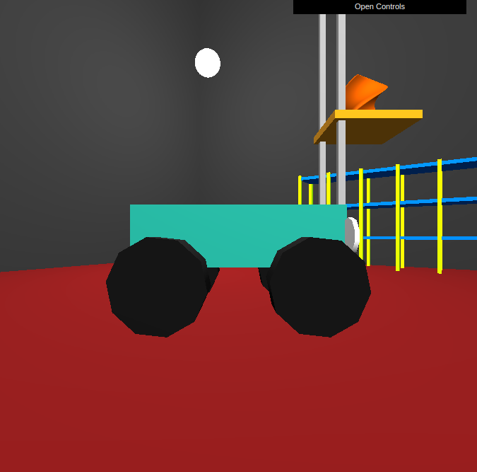

# Manual de Usuario

# Computación Gráfica - TP1

## - Joaquín Colonnello - 59574

## - Alan Sartorio - 61379

\pagebreak

## Controles:

W: Avanzar

S: Retroceder

A: Girar volante a la izquierda

D: Girar volante a la derecha

Q: Subir plataforma

E: Bajar plataforma

P: Hacer zoom in

O: Hacer zoom out

G o Espacio: Agarrar o dejar pieza

1-6: Cambiar de camara

\pagebreak

## Interfaz de usuario:

1.  Primero se debe elegir el tipo de pieza a imprimir, **Revolve** para piezas de revolución o **Sweep** para piezas de barrido.

2.  a. Revolución:
    Se debe elegir la figura del perfil de la pieza.

        { width=75% }

    b. Barrido:
    Se debe elegir la forma de la base, el angulo de torsión y la altura.

        { width=75% }

\pagebreak

## Uso:

- Generar una pieza desde el menú.
- Acercarse con el auto con W A S D.
- Ajustar la altura de la pala con Q y E.
- Agarrar la pieza con G.
- Acercarse a la estantería.
- Dejar la pieza en la celda deseada.

## Camaras

{ width=50% }

{ width=50% }

{ width=50% }

{ width=50% }

{ width=50% }

{ width=50% }
